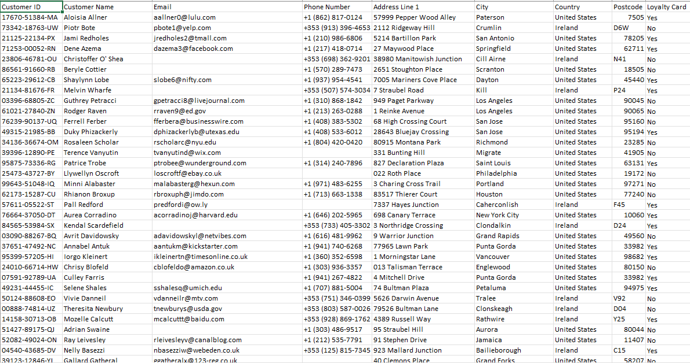
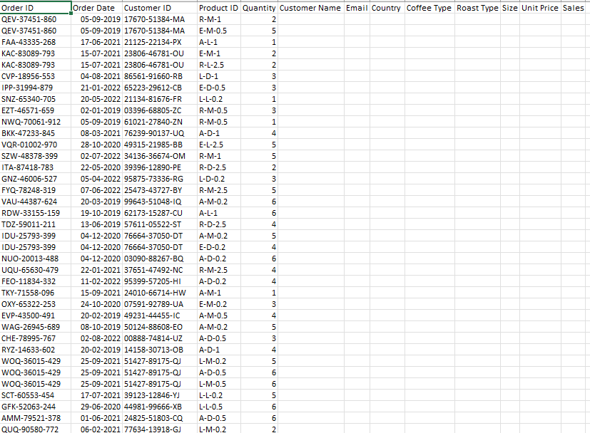
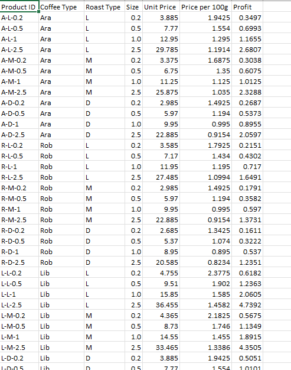

# **Excel**  
This section highlights Excel-based projects, focusing on data cleaning workflows, analysis techniques, and dashboard creation.

---
## **Project 1:**

## **Bike Sales Dashboard - Project Overview**  
The **Bike Sales Dashboard** demonstrates expertise in Excel through advanced data cleaning, transformation, and visualization techniques. It provides actionable insights into sales trends, customer demographics, and purchasing behavior.

---

### **Data Preparation**
The dataset was thoroughly cleaned and prepared for analysis using the following steps:  

1. **Standardized Data:**  
   - Applied consistent formatting (e.g., proper case for text, standardized date formats).  
   - Removed duplicates to ensure data accuracy and reliability.  

2. **Handled Missing Values:**  
   - Used "Find and Replace" to address null values.  
   - Filled missing values with meaningful substitutes like averages, medians, or "Not Applicable."  

3. **Created Age Brackets:**  
   - Grouped customers into three meaningful categories:
     - **Adolescent:** Young customers below a defined age threshold.  
     - **Middle Age:** Customers in their mid-earning years.  
     - **Old Age:** Senior customers nearing retirement or beyond.  

---

### **Data Analysis**
Key insights were derived using **pivot tables**, summarized as follows:

1. **Average Income Per Purchase:**  
   - Grouped by gender and purchasing behavior ("Yes/No").  
   - Helped identify income patterns based on gender and buying decisions.  

   **Overview of Pivot Table and Chart:**  
     

   - *This chart shows how income varies based on gender and purchasing decisions.*
---

2. **Consumer Age Bracket:**  
   - Counted purchases by age group to identify which demographic contributes the most to sales.  

   **Overview of Age Bracket Analysis:**  
     

   - *Middle-aged customers emerged as the dominant purchasing group.*
---

3. **Commute Distance:**  
   - Counted purchases by distance categories to understand trends across geographical proximity.  

   **Overview of Commute Distance Analysis:**  
   

   - *Customers commuting shorter distances made the majority of purchases.* 
---

### **Dashboard Creation**
The **Bike Sales Dashboard** integrates the findings into an interactive and visually appealing dashboard.

#### **Key Features**:
1. **Interactive Slicers:**  
   - **Marital Status:** Filter by Married/Single customers.  
   - **Geographical Region:** Focus on regions like Europe, North America, and Pacific.  
   - **Education Level:** Segment data by education levels such as Bachelors, Graduate Degrees, etc.  

2. **Visualizations:**  
   - **Bar Chart:** Displays average income per purchase segmented by gender and purchase behavior.  
   - **Line Chart:** Highlights purchase trends across different commute distances.  
   - **Age Bracket Chart:** Shows purchase patterns by demographic group.  

3. **Aesthetic Enhancements:**  
   - Clear headers and labels for easy interpretation.  
   - Integrated placeholders for relevant images, such as bicycles, maps, or customer-related visuals.  

---

### **Dashboard Snapshot**
Here’s an example of the completed **Bike Sales Dashboard**:  
  

---

### **Portfolio Presentation**
**Purpose:**  
- Demonstrates advanced skills in Excel, including data cleaning, analysis, and visualization.  
- Showcases the ability to turn raw data into actionable insights for business decision-making.  

**Design Highlights:**  
- Visually engaging layout with placeholders for relevant images to enhance professional appeal.  
- Clear segmentation of insights to guide stakeholders through key findings.  

---
---
---
---

# **Project 2:**  

---

## **Coffee Sales Dashboard - Project Overview**  
The **Coffee Sales Dashboard** showcases advanced Excel techniques such as data cleaning, transformation, visualization, and dashboard creation. It provides actionable insights into customer demographics, product performance, sales trends, and profitability.

---

### **Raw Data**  
The project begins with three datasets:

1. **Customer Data**  
   - Contains details such as `Customer ID`, `Name`, `Email`, `Country`, and `Loyalty Card`.  
    **Overview:**  
       

2. **Order Data**  
   - Includes information like `Order ID`, `Customer ID`, `Product ID`, `Order Date`, `Quantity`, and `Sales`.  
     **Overview:**  
       

3. **Product Data**  
   - Provides details such as `Product ID`, `Coffee Type`, `Roast Type`, `Size`, `Unit Price`, and `Profit`.  
     **Overview:**  
   

---

## **Data Cleaning and Preparation - Step-by-Step**  
The following steps were undertaken to clean and prepare the data for analysis:

### **1. Populating Missing Data Using XLOOKUP**
- Used `XLOOKUP` to fetch customer details (Name, Email, and Country) and product information (Coffee Type, Roast Type, Size, and Unit Price).
- Example for populating Email:  
  `=IF(XLOOKUP(C2,customers!$A$1:$A$1001,customers!$C$1:$C$1001,,0)=0,"",XLOOKUP(C2,customers!$A$1:$A$1001,customers!$C$1:$C$1001,,0))`
- Used `INDEX MATCH` for dynamic population of product data:  
  `=INDEX(products!$A$1:$G$49,MATCH(orders!$D2,products!$A$1:$A$49,0),MATCH(orders!I$1,products!$A$1:$G$1,0))`

### **2. Adding Sales Column**
- Calculated `Sales` as:  
  `=Unit Price * Quantity`

### **3. Enhancing Coffee and Roast Type Names**
- Used `IF` statements to give full names:  
  - Coffee Type:  
    `=IF(I2="Rob","Robusta",IF(I2="Exc","Excelsa",IF(I2="Ara","Arabica",IF(I2="Lib","Liberica",""))))`  
  - Roast Type:  
    `=IF(J2="M","Medium",IF(J2="L","Light",IF(J2="D","Dark","")))`

### **4. Formatting and Cleaning**
- **Date Formatting:** Changed to `dd/mmm/yyyy` for consistency.  
- **Number Formatting:**  
  - `Size`: Converted `1` to `1kg`.  
  - `Unit Price` and `Sales`: Set to USD format.  
- Removed duplicate values.  

### **5. Adding Loyalty Card**
- Auto-populated Loyalty Card column using:  
  `=XLOOKUP([@[Customer ID]],customers!$A$1:$A$1001,customers!$I$1:$I$1001,,0)`

### **6. Converting Range to Table**
- Converted cleaned data into a structured table for easier updates and analysis.

---

## **Pivot Tables and Charts**  

### **1. Pivot Table: Sales by Country**
- Summarized total sales country-wise.  
- Created a bar chart to visualize.  
*(Insert Image of Country Pivot Table and Chart Here)*  

### **2. Pivot Table: Top 5 Customers**
- Identified and ranked the top 5 customers by total sales.  
*(Insert Image of Top 5 Customers Pivot Table Here)*  

### **3. Pivot Table: Sales Over Time**
- Tracked total sales over time using a timeline filter.  
*(Insert Image of Sales Over Time Pivot Table and Chart Here)*  

---

## **Dashboard Creation**  

### **Dashboard Features**  
- Integrated 3 pivot tables and a timeline for dynamic filtering.  
- Added slicers for `Size`, `Roast Type Name`, and `Loyalty Card`.  
- Connected slicers and timeline to all pivot tables using the "Report Connection" feature.

### **Final Dashboard Includes:**  
1. **Total Sales Over Time** (with a timeline).  
2. **Sales by Country** (bar chart).  
3. **Top 5 Customers** (table).  
4. **Interactive Slicers**:  
   - **Size**  
   - **Roast Type Name**  
   - **Loyalty Card**  
*(Insert Final Dashboard Image Here)*  

---

## **Key Excel Features and Formulas Used**  
- **XLOOKUP**: To fetch data dynamically across datasets.  
- **INDEX MATCH**: For flexible and dynamic lookups.  
- **IF Statements**: To create descriptive fields for analysis.  
- **Data Formatting**: Standardized dates, numbers, and text for clarity.  
- **Pivot Tables and Charts**: Summarized and visualized key metrics.  
- **Slicers and Timeline**: For interactive and user-friendly filtering.

---

## **Conclusion**  
The **Coffee Sales Dashboard** project demonstrates proficiency in Excel for data cleaning, preparation, and visualization. It provides a comprehensive overview of sales trends, customer insights, and product performance.  

This project is a testament to leveraging Excel for strategic decision-making through advanced analysis and dashboard creation.

---

