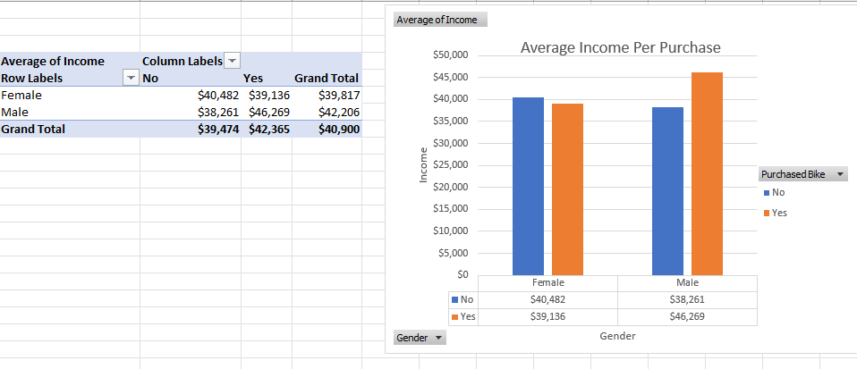
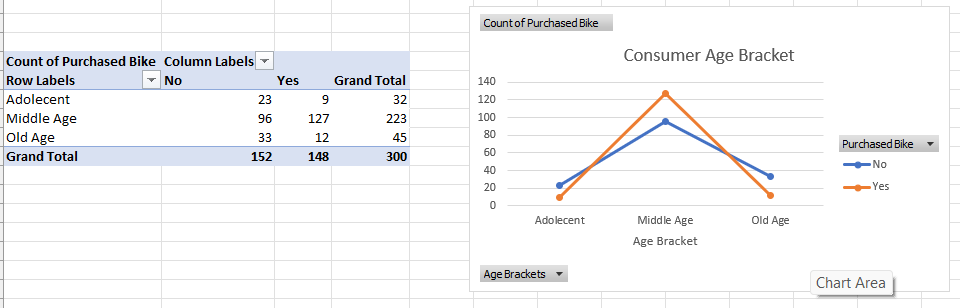
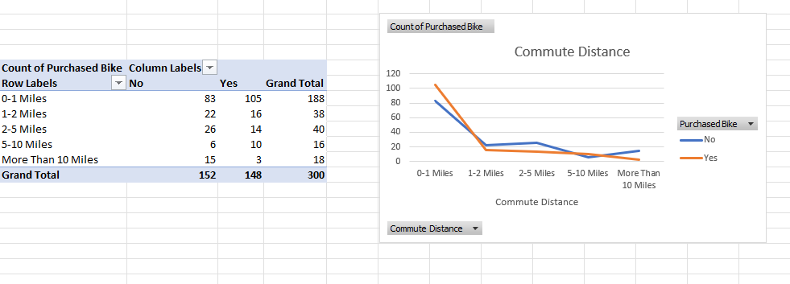
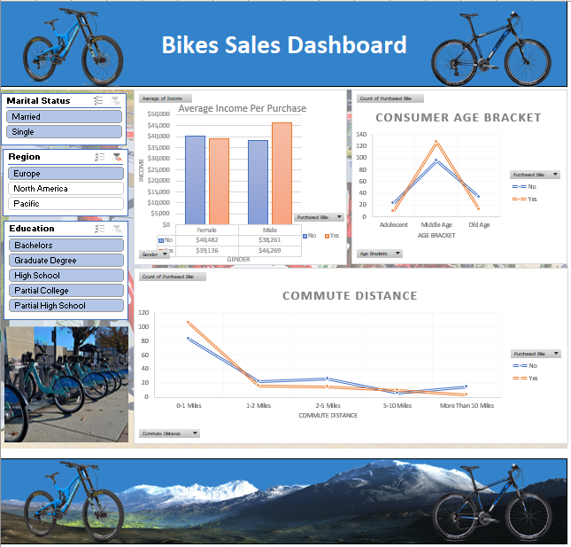

# Excel
Excel files, data cleaning workflows, and screenshots of dashboards.

## Bike Sales Dashboard - Project Overview
This project showcases a Bike Sales Dashboard created in Excel, which highlights the sales trends, customer demographics, and purchasing behavior. The steps and methods used in this project demonstrate proficiency in data cleaning, transformation, and visualization. Below is a detailed explanation of the process:

### Data Preparation
* Standardized Data:

* Ensured consistency in data format (e.g., proper case for text, consistent date formats).
* Removed any duplicates to maintain data accuracy.
* Handled Missing Values:

* Used "Find and Replace" for null values, filling them with meaningful substitutes like averages, medians, or "Not Applicable."
Created Age Brackets:

* Grouped customers into three categories:
* Adolescent: Young customers below a certain age threshold.
* Middle Age: Customers in their mid-earning years.
* Old Age: Senior customers nearing retirement or beyond.

### Data Analysis
* Pivot tables were used to summarize the data into actionable insights:

* **Average Income Per Purchase**:
* 

**Overview of Average Income Per Purchase and Pivot table** : 

* **Grouped by gender and purchasing behavior (Yes/No).**
* **Helped identify income patterns based on gender and buying decisions.**

* **Consumer Age Bracket**:

*Overview of Consumer Age Bracket and Pivot table* : 

* *Count of purchases by age group to analyze which demographic buys the most.*

  
* **Commute Distance**:

*Overview of Commute Distance and Pivot table* : 

* *Count of purchases by distance categories to understand geographical trends.*

### Dashboard Creation
* The dashboard was built to deliver insights at a glance, focusing on clarity and interactivity.

* **Key Features**:

*Overview of Bike Sales Dashboard* : 

* **Slicers**:
* Marital Status: Filter sales data by marital status (Married/Single).
* Geographical Region: Focus on sales trends in different regions (e.g., Europe, North America, Pacific).
* Education Level: Segment data by education levels (e.g., Bachelors, Graduate Degree).
 
* **Visualizations**:

* Bar Chart: Displays average income per purchase, segmented by gender and purchasing behavior.
* Line Chart: Shows trends in purchases across different commute distances.
* Age Bracket Chart: Highlights purchase behavior across age groups.
  
* **Aesthetic Enhancements**:

* Added descriptive headers and labels for easy interpretation.
* Included placeholders for images to make the dashboard visually appealing and professional.

* **Portfolio Presentation**
* Purpose:
* The dashboard demonstrates skills in Excel for data cleaning, analysis, and visualization.
* It highlights the ability to provide actionable insights for decision-making.
* Images and Design:
* The dashboard includes placeholders for adding relevant images, such as bicycles or maps, to make it engaging.

